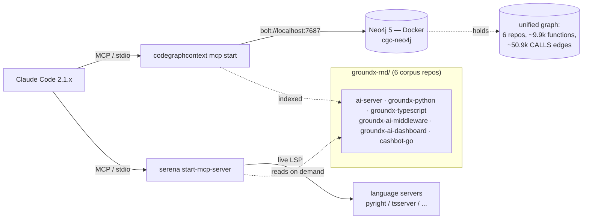

# PoC Setup — As-Built Report

**Date:** 2026-06-26. **Environment:** local machine only. **Outcome:** both finalized tools (CodeGraphContext + Serena) installed, indexed, and verified working through Claude Code. This report records *how the setup was actually performed*, the decisions taken, the problems hit and how they were resolved, and the evidence that it works. The reproducible step-by-step is in [`SETUP.md`](SETUP.md); this is the narrative as-built account.

## 1. What was set up

- **CodeGraphContext (graph arm)** — persistent code graph in a local Neo4j, serving Claude Code over MCP. One unified graph across all six corpus repos.
- **Serena (control arm)** — live LSP, on-demand, no persistent graph; activated per repo via `--project-from-cwd`.
- **Baseline arm** (plain Claude Code, no tool) — needs no setup.

## 2. Environment (verified present)

| Tool | Version |
|---|---|
| Docker | 28.3.2 (daemon running) |
| Python | 3.12.12 |
| uv | 0.8.17 |
| Node | v25.2.1 |
| Claude Code | 2.1.193 |
| CodeGraphContext | 0.5.1 |
| Serena | 1.5.3 |

`pipx` was absent; Python CLIs were installed in isolation with `uv tool` instead.

## 3. How we built it (as performed)

1. **Probed the machine** — confirmed Docker/Python/uv/Node/Claude Code and that all six corpus repos exist under `groundx-rnd/`.
2. **Scaffolded `poc/`** — `docker-compose.yml` (Neo4j), `mcp/codegraphcontext.json`, `mcp/serena.json`, `SETUP.md`.
3. **Started Neo4j** via `docker compose up -d` (container `cgc-neo4j`, ports 7474/7687, password `poctestpassword`). Ready in ~3s.
4. **Installed both tools** via `uv tool install` (CodeGraphContext gives `codegraphcontext`/`cgc`; Serena gives `serena`).
5. **Configured Neo4j creds** in `~/.codegraphcontext/.env`.
6. **Indexed the six repos** into the one Neo4j graph (per-repo `index`), then **verified** with `stats`, direct Cypher, and Claude Code smoke tests.

Two **decisions** taken during setup:
- **Neo4j over the default embedded FalkorDB** — matches the scale path we chose CodeGraphContext for (ADR 0002), gives clean isolation from pre-existing embedded data, and allows visual verification in the Neo4j browser.
- **Per-repo `index` into the shared graph** (not pointing at the parent folder) — keeps repos cleanly namespaced and `list`/`delete`-able.

## 4. Problems encountered and how they were resolved

This is the part worth remembering — two of these are non-obvious and would silently produce a useless graph.

1. **CodeGraphContext installed without tree-sitter (critical).** First index of `ai-server` reported success but `stats` showed **0 functions / 0 classes** — only 49 non-code files (json/md/txt). `codegraphcontext doctor` revealed `tree-sitter not installed: No module named 'tree_sitter'`. A plain `uv tool install codegraphcontext` does not pull tree-sitter in 0.5.1.
   - **Fix:** `uv tool install codegraphcontext --with tree-sitter --with tree-sitter-language-pack --force`. After this, re-indexing `ai-server` produced 413 functions / 76 classes / 201 modules. Always confirm via `doctor`.

2. **Default backend was FalkorDB, not Neo4j.** The first `index`/`list` reported `Using database: falkordb (source: auto-detect)` and surfaced unrelated `ostrich-*` projects from prior CGC use on this machine — i.e. the `.env` (which only holds Neo4j *creds*) did not switch the backend.
   - **Fix:** pass the global flag `--database neo4j` (it sets `CGC_RUNTIME_DB_TYPE=neo4j`) on every CLI command, and set `CGC_RUNTIME_DB_TYPE=neo4j` in the MCP server's `env`. The interactive `cgc neo4j setup` wizard was deliberately **avoided** (it would spin up its own conflicting container). The pre-existing embedded `ostrich-*` data was left untouched.

3. **`groundx-python` parser error (non-fatal).** Indexing logged `An error occurred during indexing: 'NoneType' object has no attribute 'split'` (a CGC bug on one file) but still indexed ~995 functions.
   - **Handling:** accepted for now; refresh with `update`/`index --force` later, or exclude the offending file if it recurs.

4. **Serena had no Go language server.** Serena worked immediately for Python and TypeScript (language servers auto-provisioned) but failed on `cashbot-go` with `Found a Go version but gopls is not installed`. CodeGraphContext had no such issue (tree-sitter parsed Go automatically — 7,402 Go functions).
   - **Fix:** `go install golang.org/x/tools/gopls@latest` (installed to `~/go/bin`, already on PATH). Re-test then succeeded: 3 serena tool calls, 0 gopls errors, returned real Go structs + a function definition location.
   - **Takeaway:** this is a structural difference — Serena needs the language-server *binary* for each language available on the machine (operational burden that grows with language diversity); CodeGraphContext needs none.
   - **Clarification (architecture):** this does **not** mean running multiple Serena servers. There is **one** Serena MCP server; it spawns the appropriate language server(s) (pyright/tsserver/gopls) internally per active project, including multi-language repos. The whole PoC runs exactly **two** MCP servers total — one CodeGraphContext, one Serena. Serena's one-at-a-time limit is about *projects/repos*, not languages.

### Language coverage (6-repo corpus, both tools verified)

| Language | CodeGraphContext | Serena |
|---|---|---|
| Python | ✓ tree-sitter (auto) | ✓ pyright (auto) |
| TypeScript/JS | ✓ tree-sitter (auto) | ✓ tsserver (auto) |
| Go | ✓ tree-sitter (auto) | ✓ gopls (manual install) |

Out of scope: PHP (`eyelevel-wordpress`) and other languages elsewhere in `groundx-rnd/` are not in the corpus; Serena would need their language servers if added, CGC likely already covers them via tree-sitter.

## 5. Verification evidence

**Graph contents (Neo4j, after indexing all six):**

| Metric | Count |
|---|---|
| Repositories | 6 |
| Files | ~2,730 |
| Functions | ~9,887 |
| Classes | 403 |
| Interfaces / Structs | 406 / 1,334 |
| CALLS edges | 50,916 |
| IMPORTS edges | 3,788 |
| INHERITS / IMPLEMENTS | 266 / 10 |

Functions per repo: cashbot-go ~7,402 · groundx-python ~995 · groundx-ai-dashboard ~600 · ai-server ~413 · groundx-typescript ~282 · groundx-ai-middleware ~195.

**Claude Code smoke tests (headless, `--strict-mcp-config`, `is_error: false` both):**
- *CodeGraphContext* — listed functions in `ai-server` and returned a real `CALLS` edge using only the graph tools.
- *Serena* — located `detectLayout` in `document/tasks/detect_layout.py` via LSP.

## 5b. Cross-repo enrichment (Phase 0)

A live check of the populated graph found it could not answer any cross-repo question: **0 cross-repo `CALLS`, 0 cross-repo `IMPORTS`**, and all 3,788 `IMPORTS` edges were unresolved name stubs (target `path = NULL`). The "unified graph" was six **disjoint** per-repo subgraphs — because the real coupling between these repos is **service-level** (HTTP/REST/webhook), which tree-sitter cannot parse. That coupling is recorded in the hand-authored C4 model `groundx-rnd/workspace.dsl`.

**Fix (`poc/enrich/enrich.py`):** parse the dsl's model-block relationships and write repo-level `CALLS_SERVICE` edges onto the existing `:Repository` nodes. Tool-agnostic (operates on the graph, no CGC fork), idempotent (`MERGE`).

**Result:** 4 cross-repo edges among the six repos — `groundx-ai-dashboard → groundx-ai-middleware → cashbot-go ⇄ ai-server`, with protocol/endpoint labels (e.g. `DocumentLayoutWebhook`, `POST /layout`). 31 out-of-corpus/infra relationships (mysql, redis, stripe, `internal-arcadia-agents`, …) were skipped and logged. Verified functionally: a headless Claude Code run using only CGC tools (direct Cypher) answered "what is up/downstream of ai-server" correctly from these edges (`is_error: false`) — data that exists *only* in the enriched graph.

**Honest ceiling:** edges are repo/service granularity, not function-level; symbol-precise cross-wire mapping (which handler decodes a payload) would need OpenAPI enrichment and is deferred. Full rationale and the benchmark design it unblocks: [`benchmark-design.md`](benchmark-design.md).

## 6. Current state

- Neo4j container `cgc-neo4j` running (graph persisted in a Docker volume); enriched with 4 cross-repo `CALLS_SERVICE` edges.
- Both tools installed via `uv tool`; MCP config files under `poc/mcp/`.
- Ready for the benchmark phase (4 arms: baseline / CGC / Serena / both) — arm isolation verified via `poc/dryrun-isolation.sh`; gated on per-repo test-suite buildability (see design doc §4.4–4.5).

## 7. Reproduce / teardown

See [`SETUP.md`](SETUP.md) for exact commands. Teardown: `docker compose -f poc/docker-compose.yml down -v` and `uv tool uninstall codegraphcontext serena-agent`.

## 8. Caveats / open items

- **`groundx-python`** indexing has a known non-fatal parser error (above).
- **Security (low):** the Neo4j password `poctestpassword` is in plaintext in `poc/docker-compose.yml` and `poc/mcp/codegraphcontext.json` — acceptable as a throwaway local-only credential on a container with no real data; do not reuse it anywhere real.
- **Freshness:** the graph is a point-in-time index; re-run `index`/`update` after code changes (auto-sync is out of scope for this PoC).
- **Next:** define the task corpus and run the 4-arm benchmark (metrics in `../docs/research/context-graph-evaluation.md` §3.6; arms + isolation in [`benchmark-design.md`](benchmark-design.md) §4).
